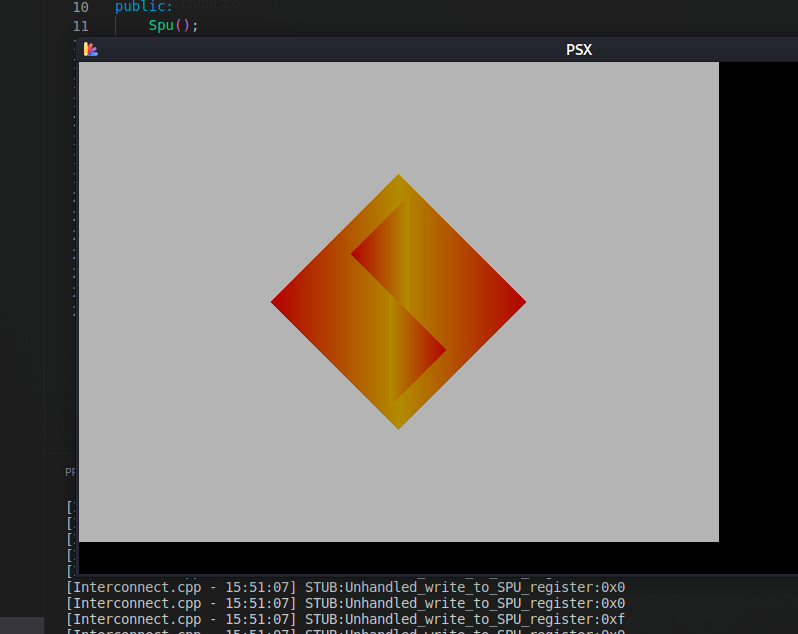

# YA-PSX-EMU

WIP Playstation (PSX) emulator in C++.

Tested on (Kali) Linux only. MAC OSX does not support all OpenGL functions, so that is WIP. Not sure about Windows.

### Credits

* Playstation Emulation Guide (Rust) - https://github.com/simias/psx-guide <- must read, base for this
* Nocash PSX specifications - https://problemkaputt.de/psx-spx.htm <- best console internals documentation 
* MIPS Opcodes - http://mipsconverter.com/opcodes.html <- handy when implementing CPU
* Learn Modern OpenGL - https://learnopengl.com/ <- for opengl stuff
* SPU specs - https://gamehacking.org/faqs/psx_reg.pdf <- SPU registers
* GPU Pipeline - https://www.reddit.com/r/EmuDev/comments/fmhtcn/article_the_ps1_gpu_texture_pipeline_and_how_to/ <- emulating gpu textures